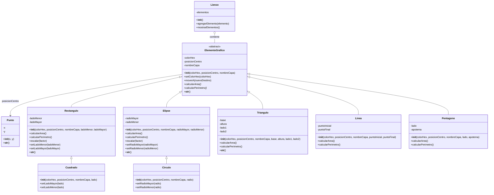

```mermaid
classDiagram

    class Punto {
        -x
        -y
        +__init__(x, y)
        +__str__()
    }

    class ElementoGrafico {
        <<abstract>>
        -colorHex
        -posicionCentro
        -nombreCapa
        +__init__(colorHex, posicionCentro, nombreCapa)
        +setColorHex(colorHex)
        +moverA(nuevoDestino)
        +calcularArea()*
        +calcularPerimetro()*
        +__str__()
    }

    class Rectangulo {
        -ladoMenor
        -ladoMayor
        +__init__(colorHex, posicionCentro, nombreCapa, ladoMenor, ladoMayor)
        +calcularArea()
        +calcularPerimetro()
        +escalar(factor)
        +setLadoMenor(ladoMenor)
        +setLadoMayor(ladoMayor)
        +__str__()
    }

    class Cuadrado {
        +__init__(colorHex, posicionCentro, nombreCapa, lado)
        +setLadoMayor(lado)
        +setLadoMenor(lado)
    }

    class Elipse {
        -radioMayor
        -radioMenor
        +__init__(colorHex, posicionCentro, nombreCapa, radioMayor, radioMenor)
        +calcularArea()
        +calcularPerimetro()
        +escalar(factor)
        +setRadioMayor(radioMayor)
        +setRadioMenor(radioMenor)
        +__str__()
    }

    class Circulo {
        +__init__(colorHex, posicionCentro, nombreCapa, radio)
        +setRadioMayor(radio)
        +setRadioMenor(radio)
    }

    class Triangulo {
        -base
        -altura
        -lado1
        -lado2
        +__init__(colorHex, posicionCentro, nombreCapa, base, altura, lado1, lado2)
        +calcularArea()
        +calcularPerimetro()
        +__str__()
    }

    class Linea {
        -puntoInicial
        -puntoFinal
        +__init__(colorHex, posicionCentro, nombreCapa, puntoInicial, puntoFinal)
        +calcularArea()
        +calcularPerimetro()
    }

    class Pentagono {
        -lado
        -apotema
        +__init__(colorHex, posicionCentro, nombreCapa, lado, apotema)
        +calcularArea()
        +calcularPerimetro()
    }

    class Lienzo {
        -elementos
        +__init__()
        +agregarElemento(elemento)
        +mostrarElementos()
    }


    ElementoGrafico <|-- Rectangulo
    Rectangulo <|-- Cuadrado

    ElementoGrafico <|-- Elipse
    Elipse <|-- Circulo

    ElementoGrafico <|-- Triangulo
    ElementoGrafico <|-- Linea
    ElementoGrafico <|-- Pentagono

    ElementoGrafico --> Punto : posicionCentro
    Lienzo o-- ElementoGrafico : contiene
```